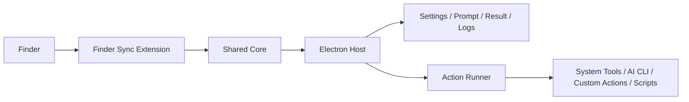
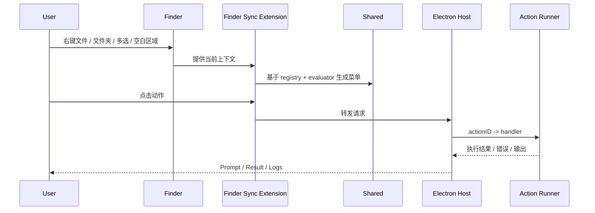

# U-Right

[](https://www.apple.com/macos/)
[](#架构图)
[](#我们在做什么)
[](#核心优势)
[](#当前产品形态)

U-Right 是一个面向 macOS Finder 的超级右键工具，目标是在 Finder 原生上下文里，提供稳定、可配置、可扩展的高频文件操作与 AI 辅助能力。

它不是“再做一个文件管理器”，而是把真正高频、真正有价值的能力放回 Finder 右键这一跳里，让用户少切窗口、少找工具、少重复操作。

> 把复杂能力带回 Finder，而不是把用户从 Finder 里拽出去。

## 产品定位

| 维度 | U-Right 的选择 |
| --- | --- |
| 入口 | Finder 原生右键菜单 |
| 核心价值 | 高频文件操作 + 上下文感知 AI |
| 架构策略 | 原生扩展 + Electron Host + Shared 单源 |
| 产品取向 | 可维护、可验证、可持续演进 |
| 当前阶段 | 可运行原型，持续硬化中 |

## 我们在做什么

U-Right 当前采用混合架构主线：

- 原生 `Finder Sync Extension`：采集 Finder 上下文、生成菜单、转发请求
- `Electron Host`：设置、日志、Prompt、Result、动作执行
- `Shared` 集成层：动作注册表、设置模型、上下文评估、共享协议

旧的原生 AppKit Host 仍保留，但当前只作为兼容 / 对照路径，不是默认开发主线。

## 为什么这个项目值得做

很多 Finder 工具要么太轻，只能做少量固定动作；要么太重，脱离 Finder 原生体验；要么 AI 集成只是“挂个按钮”，没有真正进入上下文。

U-Right 想解决的是三件事：

- 让高频动作直接发生在 Finder 上下文里
- 让设置、菜单预览、实际执行保持一致
- 让 AI 真正理解当前选择、当前目录和当前操作意图，而不是脱离上下文地单独提问

## 适合谁

- 经常在 Finder 里处理文件、目录、模板和脚本的开发者
- 想把终端、编辑器、AI 辅助动作收进统一右键体验的效率用户
- 希望在 macOS 原生上下文里做更复杂工作流，而不是反复切应用的团队
- 需要一个更适合 AI 协作开发和长期维护的 Finder 工具项目的贡献者

## 核心优势

### 1. 混合架构，更贴近系统真实边界

我们不假设纯 Electron 可以替代 Finder Sync。

- Finder 集成必须走原生扩展
- 复杂 UI 和快速迭代更适合 Electron
- 共享层负责统一动作、设置和协议，减少跨端漂移

这让我们既能保持 Finder 原生接入能力，也能获得更快的 UI 和功能迭代速度。

### 2. 强调“单一真相源”

U-Right 当前在持续收敛：

- 动作定义单源
- 设置模型单轨
- 菜单、预览、执行尽量复用同一套语义

这对 AI 协作开发尤其重要。系统里的真相越少，后续越不容易改出分叉和隐性 bug。

### 3. 动作不是堆功能，而是走统一执行链路

当前能力不是“哪里能加就哪里塞”，而是统一经过：

- `ActionRegistry`
- `ActionEvaluator`
- `ActionMenuBuilder`
- `actionID -> handler`

这意味着后续新增动作、隐藏未完成动作、解释为什么某个动作不可见，都能放在同一套框架里演进。

### 4. AI 集成更重视真实工作流

当前 AI 路径已经支持：

- Claude / Codex CLI 优先
- API fallback
- Prompt 编辑
- Result 展示与回写

重点不是做很多“看起来很酷”的 AI 菜单项，而是先把真正高频、真正可验证的 AI 工作流打稳。

## 为什么 U-Right 不一样

| 常见问题 | U-Right 的处理方式 |
| --- | --- |
| 纯桌面壳方案碰不到 Finder 真边界 | 保留原生 `Finder Sync Extension`，不做能力幻想 |
| 菜单、设置、执行三套规则容易漂移 | 用 Shared 收拢 registry、evaluator 和协议 |
| 动作越加越乱，最后很难维护 | 统一走 `actionID -> handler` 执行链路 |
| AI 功能很花哨，但没有上下文 | 把当前选择、目录、工具链和 Prompt 工作流连起来 |
| 功能做了一半就暴露给用户 | 未完成动作默认隐藏，先验证再开放 |

## 架构图



## 当前产品形态

项目当前处于 **可运行原型（Hardening 中）** 阶段。

已经打通：

- Finder 菜单主链路
- Electron Host 请求监听与执行链路
- Settings / Prompt / Result / Logs 基础体验
- Context Menu 工作台基础体验
- 一批高频动作执行链路

当前已经接通的典型动作包括：

- 创建：`create.new-file`、`create.new-folder`、`create.template.*`
- 打开：`open.terminal`、`open.vscode`、`open.cursor`、`open.zed`、`open.custom.*`
- 复制：`copy.path`、`copy.relative-path`、`copy.filename`、`copy.basename`、`copy.extension`
- 文件：`file.rename`、`file.trash`、`file.duplicate`、`file.compress`、`file.json-format`
- 视图：`view.refresh`、`view.toggle-hidden`
- AI：`ai.ask-claude`、`ai.ask-codex`
- 扩展：`script.run.*`、`git.status`

还没完成：

- 多级子菜单树编辑器
- 一批默认隐藏动作的真正落地
- 发布级签名与公证
- 最小自动化验证体系

## 典型使用场景

### 开发者文件工作流

- 在 Finder 中直接新建文件 / 模板文件
- 一键打开 Terminal、VS Code、Cursor、Zed 或自定义工具
- 快速复制路径、文件名、扩展名，减少手动整理

### AI 辅助工作流

- 对当前选中的文件或目录直接发起 Claude / Codex 询问
- 在确认 Prompt 后继续执行，避免黑箱式操作
- 通过 Result 窗口查看输出、错误和后续动作

### 团队定制工作流

- 通过模板、自定义打开方式、脚本动作适配团队习惯
- 用统一配置控制菜单展示与执行行为
- 逐步沉淀适合团队的 Finder 上下文工具箱

## 能力矩阵

| 能力域 | 当前状态 | 说明 |
| --- | --- | --- |
| Finder 菜单主链路 | 已打通 | 文件、文件夹、多选、空白区域是核心验证上下文 |
| Settings / Preview | 可用 | 菜单设置与预览已形成基础闭环 |
| 高频文件动作 | 可用 | 创建、复制、重命名、删除、压缩等已接通主链路 |
| AI 主链路 | 可用 | `ask-claude` / `ask-codex` 已接通，CLI 优先 |
| 模板 / 脚本 / 自定义动作 | MVP | 已接统一执行链路，配置体验仍在打磨 |
| 多级菜单编辑 | 规划中 | 当前还是一层工作台，不是真正树编辑器 |
| 发布级签名与公证 | 未完成 | 属于发布前必须补齐的链路 |

## 一个典型执行链路



## 我们怎么保证可维护性

这个项目从一开始就不希望变成“功能越来越多，规则越来越散”的工具仓库。

当前的工程原则是：

- Finder Extension 保持薄
- 共享层保持清楚
- 宿主层负责复杂 UI 和执行
- 未完成动作默认隐藏
- 设置改动必须真实影响菜单、预览和执行
- 新动作优先走 registry，不走散落条件分支

如果你关注 AI 参与开发的可持续性，这些约束也是项目的一个重要优势。我们在刻意减少双轨配置、隐式 fallback 和多处重复定义。

## 开发哲学

我们更看重下面这些事情，而不是“功能列表看起来很多”：

- 真实上下文里能不能稳定出菜单
- 设置改动能不能真正影响实际行为
- 新动作是否能低成本进入统一链路
- AI 参与开发后，系统是否仍然清晰可维护

换句话说，U-Right 的竞争力不只是功能，而是：

**在 Finder 这种高摩擦、强系统边界的环境里，把复杂能力做得既可用又可持续。**

## 当前开发入口

### 开发

```bash
make dev
```

这条命令会：

- 构建并安装 `/Applications/U-Right.app`
- 刷新 Finder Extension
- 清理旧 Electron / Vite 进程
- 启动当前 Electron Host

### 常用命令

```bash
make dev
make build CONFIG=Debug
make build CONFIG=Release
make install CONFIG=Debug
make extension-status
make doctor
make dump-entitlements
make debug-unified-log
```

## 目录结构

- `Sources/URightFinderExtension`：Finder Sync Extension
- `Sources/URightShared`：共享模型、设置、注册表、handoff
- `Sources/URightHost`：旧原生宿主，对照路径
- `electron/`：当前默认宿主主线
- `Resources/App`：宿主资源与 entitlements
- `Resources/Extension`：扩展资源与 entitlements
- `scripts/`：构建、安装、启动、排障脚本
- `specs/`：多文件功能与重构的轻量规格

## 未来计划

下面这些是当前阶段真实且有价值的未来方向，不是远期幻想：

### 近期

- 继续拆分 `dispatcher`，按业务域收口 handler
- 补齐高频动作缺口，如 `folder.search`、`folder.size`、`folder.count`
- 把模板、自定义打开、脚本动作配置闭环做扎实
- 固化最小手动验证与 smoke 验证

### 中期

- 把 `Context Menu` 从一层工作台升级为真正的多级子菜单编辑器
- 提升高级 AI 动作的质量，只开放少量高价值动作
- 做稳 Finder 实际菜单与 Preview 的一致性验证
- 完成发布链路所需的签名、公证、产物校验

### 长期

- 形成更稳定的插件化 / 自定义动作生态基础
- 继续打磨 AI 在文件上下文中的可解释性与可确认性
- 在不破坏 Finder 原生体验的前提下，扩展更高价值的团队工作流

## 我们希望最终做到

- 用户把 U-Right 当成 Finder 的自然延伸，而不是外接插件
- 高频动作在一跳内完成，不再切换多个窗口和工具
- AI 能理解“此刻在 Finder 里到底选中了什么、准备做什么”
- 新能力可以持续增加，但系统整体仍然清楚、稳定、可维护

## 开发路线图


## 项目文档

- 项目进度：[docs/project-progress.md](/Users/qingli/Projects/agent_servers/claude-uright/docs/project-progress.md)
- 收缩原则与 TODO：[docs/product-planning-settings-contextmenu-ai.md](/Users/qingli/Projects/agent_servers/claude-uright/docs/product-planning-settings-contextmenu-ai.md)
- 动作状态：[docs/action-implementation-status.md](/Users/qingli/Projects/agent_servers/claude-uright/docs/action-implementation-status.md)
- 实施轨道：[docs/implementation-tracks.md](/Users/qingli/Projects/agent_servers/claude-uright/docs/implementation-tracks.md)
- 手动验证：[docs/manual-validation-checklist.md](/Users/qingli/Projects/agent_servers/claude-uright/docs/manual-validation-checklist.md)
- Finder 排障：[docs/finder-sync-debugging.md](/Users/qingli/Projects/agent_servers/claude-uright/docs/finder-sync-debugging.md)
- 发布清单：[docs/release-checklist.md](/Users/qingli/Projects/agent_servers/claude-uright/docs/release-checklist.md)

## 当前约定

- 默认开发入口：`make dev`
- 默认权威安装路径：`/Applications/U-Right.app`
- 菜单有问题时，先看 Finder 扩展状态、安装路径和统一日志
